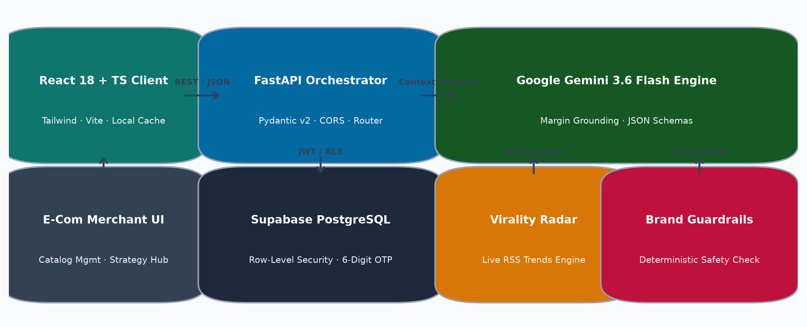

# 🚀 MarketPilot AI — Autonomous E-Commerce Marketing Intelligence & Campaign Engine

[](https://fastapi.tiangolo.com)
[](https://reactjs.org)
[](https://www.typescriptlang.org)
[](https://tailwindcss.com)
[](https://supabase.com)
[](https://ai.google.dev)
[](LICENSE)

**MarketPilot AI** is a production-grade autonomous marketing strategist and content generation platform designed for e-commerce brands, direct-to-consumer (D2C) founders, and marketing teams. It combines real-time viral trend signals, catalog profit economics, and LLM orchestration to formulate high-ROAS marketing campaigns with zero hallucinations.

---

## 🌐 Live Deployments

| Component | Status | URL |
| :--- | :--- | :--- |
| **Frontend Web App** | Production (Vercel) | [https://marketpilot-iota.vercel.app](https://marketpilot-iota.vercel.app) |
| **API Backend** | Production (Render) | [https://marketpilot-r22y.onrender.com](https://marketpilot-r22y.onrender.com) |
| **Interactive API Docs** | Swagger UI | [https://marketpilot-r22y.onrender.com/docs](https://marketpilot-r22y.onrender.com/docs) |

---

## 🏛️ System Architecture



The platform operates on a three-tier decoupled architecture:
1. **Presentation Layer (React 18 + Vite + TypeScript)**: High-speed SPA styled with Tailwind CSS, featuring real-time state management, currency selector, and responsive public/dashboard routes.
2. **Orchestration Layer (FastAPI + Pydantic v2)**: High-throughput async REST API with strict request validation, non-blocking background workers, and automated profile lifecycle management.
3. **Intelligence & Data Layer (Google Gemini + Supabase PostgreSQL)**: LLM campaign synthesis grounded in store margin data, backed by Supabase Auth with Row-Level Security (RLS).

---

## 🌟 Key Features

### 🧠 1. Margin-Aware AI Strategy Generation
- Formulates four-pillar campaigns: **Hero Awareness**, **Direct Response Acquisition**, **Trend Velocity**, and **VIP Retention**.
- Calculates catalog profit margins (`Retail Price - Cost Price`) to prioritize high-margin inventory for paid ad spend, maximizing return on ad spend (ROAS).

### 📈 2. Real-Time Trend Intelligence
- Aggregates and scores viral e-commerce trends from live RSS feeds and market data.
- Associates trends with relevant catalog items and assigns velocity confidence scores to guide timely campaigns.

### ✍️ 3. Multi-Format Content Studio
- Generates publication-ready creative assets across 5 high-converting formats:
  - **Social Post Captions**: Engaging copy with hooks, call-to-actions, and targeted hashtags.
  - **5-Slide Visual Carousels**: Structured slide-by-slide breakdowns with visual directives.
  - **Short-Form Video Scripts**: Timed hooks, audio cues, and scene-by-scene camera instructions.
  - **Email Newsletters**: Conversational subject lines, value props, and conversion CTAs.
  - **WhatsApp & SMS Broadcasts**: High-urgency promotional notifications.

### 🛡️ 4. Deterministic Brand Guardrails
- Validates brand voice attributes (e.g., Authentic, Professional, Value-Driven).
- Employs regex safety barriers and LLM checks to block prohibited phrases (e.g., *"guaranteed 100%"*, *"miracle cure"*).
- Grounded catalog ingestion prevents the AI from inventing non-existent items or inaccurate prices.

### 🔒 5. Enterprise-Grade Authentication & Session Lifecycle
- **Code-Based Email Verification**: Delivers clean confirmation codes directly to Gmail inboxes with support for standard 6-digit codes and 8-digit Supabase tokens.
- **Asynchronous Non-Blocking Delivery**: Email dispatch via SSL runs in background daemon threads, providing near-instant UI screen transitions (<300ms).
- **Inactivity Timeout (4 Hours)**: Automatically expires sessions after 4 hours of idle time without interaction.
- **Hard Session Limit (24 Hours)**: Enforces daily re-authentication to prevent persistent unauthorized access.
- **Multi-Tab Logout Synchronization**: Instantly syncs logouts and session invalidations across all open browser tabs.
- **Global 401 Interceptor**: Safely clears expired credentials and redirects to the login screen with clear notification banners.

### 📦 6. Multi-Format Export Center
- Exports campaign deliverables in one click:
  - **Markdown Campaign Briefs** for internal agency review.
  - **CSV Copywriting Sheets** for social media scheduling tools.
  - **JSON Backups** for data portability.

---

## 📁 Repository Structure

```
.
├── architecture_diagram.png      # High-resolution architectural diagram
├── README.md                     # Platform documentation
├── render.yaml                   # Infrastructure-as-code for Render deployment
├── start_project.bat             # Dual-server local development launcher
│
├── marketpilot-auth-backend/     # FastAPI Python 3.10+ Backend
│   ├── requirements.txt          # Python dependencies
│   ├── pytest.ini               # Pytest test suite configuration
│   ├── sitecustomize.py          # Module path setup
│   ├── src/
│   │   └── app/
│   │       ├── main.py           # FastAPI entrypoint & CORS middleware
│   │       ├── config.py         # Pydantic Settings & environment variables
│   │       ├── dependencies.py   # JWT Bearer auth & RLS validation
│   │       ├── schemas.py        # Pydantic v2 data models
│   │       ├── supabase_client.py# Supabase admin & anon client helpers
│   │       ├── routers/          # API route modules (auth, products, strategy, etc.)
│   │       └── services/         # Core business logic, LLM orchestrator & emailer
│   └── tests/                    # Comprehensive Pytest test suite (109 tests)
│
└── marketpilot-frontend/         # React 18 + Vite + TypeScript Frontend
    ├── package.json              # NPM dependencies & build scripts
    ├── vite.config.ts            # Vite build configuration
    ├── tailwind.config.js        # Custom design system tokens
    ├── vercel.json               # SPA routing rewrite configuration for Vercel
    └── src/
        ├── App.tsx               # Primary dashboard layout
        ├── router.tsx            # Declarative routing (Public & Protected routes)
        ├── api/                  # Axios HTTP client with auto-session interceptors
        ├── context/              # AuthContext & CurrencyContext
        ├── components/           # UI components, modals, sidebar, navbar
        ├── pages/                # Protected views (Overview, Studio, Planner, etc.)
        ├── pages/public/         # Public pages (Landing, Pricing, Login, Signup)
        └── utils/                # Session lifecycle & JWT expiration helpers
```

---

## ⚙️ Environment Variables Guide

### Backend (`marketpilot-auth-backend/.env`)

Copy the template below to set up your local backend environment:

```ini
# Application Configuration
ENVIRONMENT=development
FRONTEND_ORIGINS=http://localhost:3000,http://127.0.0.1:3000,https://marketpilot-iota.vercel.app

# Supabase Database & Auth
SUPABASE_URL=https://your-project-id.supabase.co
SUPABASE_ANON_KEY=your-supabase-anon-key
SUPABASE_SERVICE_ROLE_KEY=your-supabase-service-role-key

# Google Gemini AI
GEMINI_API_KEY=your-google-gemini-api-key
GEMINI_MODEL=gemini-3.6-flash

# Email Delivery (Google SMTP via SSL)
SMTP_HOST=smtp.gmail.com
SMTP_PORT=465
SMTP_USER=your-email@gmail.com
SMTP_PASSWORD=your-google-app-password
SMTP_FROM=your-email@gmail.com

# Password Reset URL
PASSWORD_RESET_REDIRECT_URL=http://localhost:3000/reset-password
```

### Frontend (`marketpilot-frontend/.env.local`)

```ini
VITE_API_URL=http://127.0.0.1:8000/api/v1
```

> [!IMPORTANT]
> Never commit `.env` or plain credential files to GitHub. All production secrets are managed securely via Render and Vercel environment variable dashboards.

---

## 🚀 Local Development Setup

### Prerequisites
- **Python 3.10+**
- **Node.js 18+** & **npm**

### Quick Start (Windows)
Run the automated batch launcher from the root folder:
```cmd
start_project.bat
```
This initializes both the FastAPI backend on port `8000` and Vite frontend on port `3000`.

### Manual Setup

#### 1. Backend
```bash
cd marketpilot-auth-backend
python -m venv .venv

# On Windows:
.\.venv\Scripts\activate
# On macOS/Linux:
source .venv/bin/activate

pip install -r requirements.txt
uvicorn app.main:app --app-dir src --reload --port 8000
```
- API Endpoint: `http://127.0.0.1:8000`
- Interactive Swagger Docs: `http://127.0.0.1:8000/docs`

#### 2. Frontend
```bash
cd marketpilot-frontend
npm install
npm run dev -- --port 3000
```
- Web Application: `http://localhost:3000`

---

## 🧪 Testing & Verification

The backend includes an automated test suite with **109 passing tests** covering authentication, product catalog operations, Gemini LLM prompts, guardrail validations, and reporting.

To run the backend test suite:
```bash
cd marketpilot-auth-backend
pytest -v
```

To build and type-check the frontend:
```bash
cd marketpilot-frontend
npm run build
```

---

## 📄 License
This project is licensed under the [MIT License](LICENSE).
